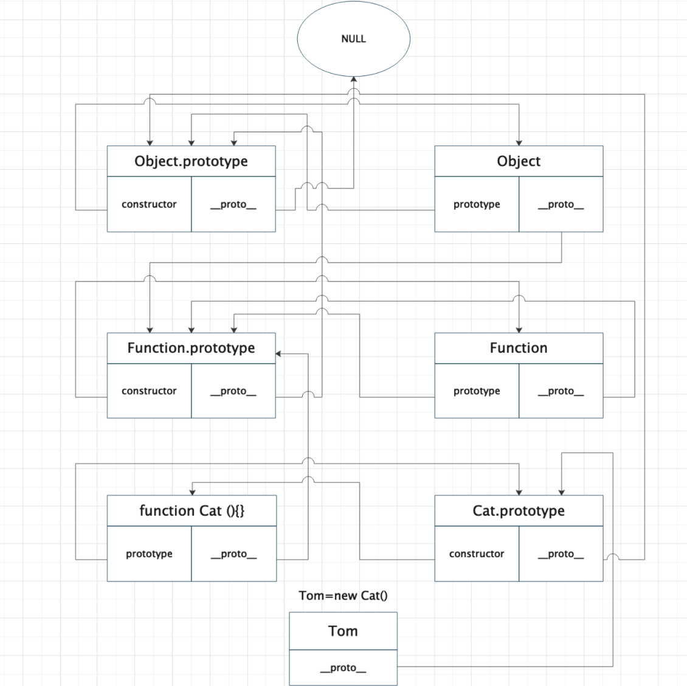

# 原型链



```
function Cat (name) {
    this.name = name;
}

Cat.prototype.color = 'white';

var cat1 = new Cat('Tom');
console.log(cat1)//{name:'tom'}
var cat2 = new Cat('Mark');
console.log(cat2)//{name:'Mark'}
cat1.color = 'black';
console.log(cat1,cat2)//{name:'tom',color:'black'}{name:'tom'}
console.log(cat1.color)//black
console.log(Cat.color)//函数无法直接获取属性
```

## 什么是原型链？

访问一个对象的属性时，先在基本属性中查找，如果没有，再沿着 proto 这条链向上找，这条链便是原型链。

原型链解决的问题，多个实例共享属性方法的问题，减少开辟内存空间。

## 【_proto_】与 prototype（显式原型）

- 所有对象都有【_proto_】隐式原型,而只有函数对象才有 prototype。
- 函数是一个特殊的对象，当一个函数被创建后，这个函数会附带一个属性 prototype，prototype 代表函数的原型。

- prototype 对象有两个属性，constructor 和 【_proto_】。
- constructor 这个属性指创建原型的函数，它指向函数本身，而【_proto_】指向原型对象。

## constructor

NothingSpecial 只是一个普通的函数.当使用 new 调用时，就会构造一个对象并赋值给 a,此时 NothingSpecial(){}是构造函数。但 NothingSpecial 本身并不是构造函数。

```$xslt
function Foo() {
  }
  let a = new Foo(); // true
  console.log(a);
```

- Foo.prototype.constructor == a.constructor == a[__proto__]constructor == Foo

```$xslt
function NothingSpecial() { console.log( "Don't mind me!" );
}
var a = new NothingSpecial();
// "Don't mind me!" a; // {}

```
